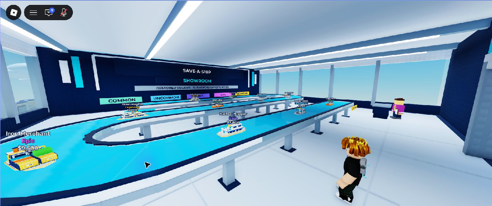
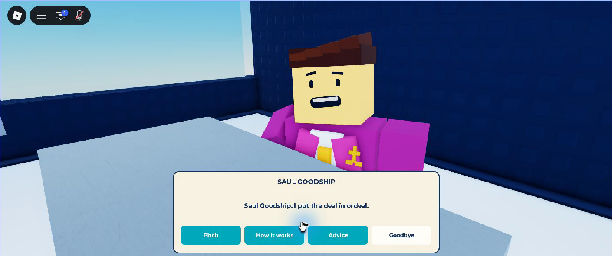

# Raise a Wreck — verification photos and videos

Temporary download folder requested by the project owner.

- [Download all five photos (ZIP)](showroom-verification-photos.zip?raw=true)
- [Download the new laser-cleaning clip (MP4, 14.98 seconds, 16.89 MB)](fishing-laser-15s.mp4?raw=true)
- [Download the showroom-channel clip (MP4, about 15 seconds, 3.84 MB)](showroom-channel-download.mp4?raw=true)
- [File sizes and SHA-256 hashes](download-manifest.json)

## Photos

[Showroom overview](channel-wide.png?raw=true) · [Arrival](arrival.png?raw=true) · [Saul Goodship](saul.png?raw=true) · [Phone dialogue](phone-saul.png?raw=true) · [Phone claim](phone-claim.png?raw=true)

The photos are original in-game captures. The showroom video is a smaller H.264/AAC copy of the same native capture, preserving its 1760×736 resolution and all 452 frames (about 15 seconds). Camera framing and genuine market stock were staged for filming; the channel uses the real movement and offer system. The final Saul closeup follows a small face correction made after the video.

## New laser-cleaning clip

The laser clip is an original native Roblox capture at 1760×720 with audio. Approximately the first 8–10 seconds show laser cleaning; the remainder returns to the Tug view. Native capture omits the HUD. This is a visual sample, not a full restoration-completion recording. The showroom photos and channel clip above are from the earlier showroom verification pass.
